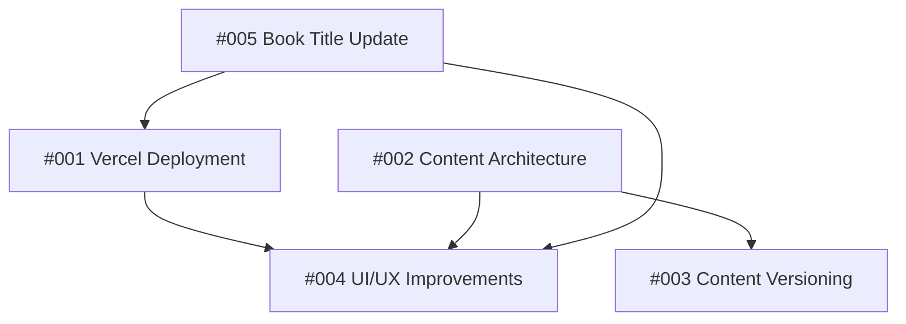

# Issues Tracker

This folder contains detailed GitHub-style issues for the Brutal Honesty Handbook project. Each issue is a markdown file with comprehensive descriptions, acceptance criteria, and implementation plans.

## Current Issues

### 🚀 High Priority

#### [#001 - Setup Vercel Deployment for Static Site](./001-vercel-deployment-setup.md)
**Status**: ✅ Completed | **Estimated Time**: 2-3 hours  
**Labels**: `deployment`, `infrastructure`, `setup`

Set up the repository for easy deployment on Vercel as a static site to make the digital book accessible online.

**Key Tasks**:
- Create Vercel configuration
- Set up CI/CD pipeline
- Configure routing for SPA
- Test production deployment

---

#### [#002 - Evaluate and Refactor Content Architecture](./002-content-architecture-refactor.md)
**Status**: Open | **Estimated Time**: 4-6 hours  
**Labels**: `architecture`, `content-management`, `developer-experience`

Replace the current JSON-based content system with a more maintainable, editor-friendly solution using Markdown files.

**Key Tasks**:
- Migrate from JSON to Markdown + frontmatter
- Create build process for content
- Improve editor experience
- Add content validation

---

#### [#004 - UI/UX Improvements and CSS Architecture Refactor](./004-ui-ux-improvements.md)
**Status**: Open | **Estimated Time**: 5-7 hours  
**Labels**: `ui`, `ux`, `css-architecture`, `user-experience`

Improve overall user experience, fix navigation issues, and refactor CSS architecture for better maintainability.

**Key Tasks**:
- Fix scroll position reset on navigation
- Refactor CSS into component-based architecture
- Add reading progress indicators
- Improve mobile navigation

### 📋 Medium Priority

#### [#003 - Implement Content Versioning and Changelog](./003-content-versioning-changelog.md)
**Status**: Open | **Estimated Time**: 3-4 hours  
**Labels**: `content-management`, `versioning`, `user-experience`

Implement a versioning system for book content with changelog to help readers track updates.

**Key Tasks**:
- Implement semantic versioning
- Create changelog generation
- Add "What's New" functionality
- Track reading progress across versions

---

#### [#005 - Update Book Title and Branding](./005-book-title-and-branding-update.md)
**Status**: Open | **Estimated Time**: 1-2 hours  
**Labels**: `branding`, `content`, `ui-update`

Update the book title and add proper author attribution throughout the application.

**Key Tasks**:
- Change title to "The Original Field Guide for Brutal Honesty"
- Add author attribution: "Mike Kamminga aka The Cult Leader"
- Update all meta tags and references
- Ensure responsive design with longer title

## Issue Dependencies

## Recommended Implementation Order

1. ✅ **[#001 Vercel Deployment](./001-vercel-deployment-setup.md)** (2-3 hours) - **COMPLETED**
   - Enables public access and testing
   - Required for feedback collection

2. **[#005 Book Title Update](./005-book-title-and-branding-update.md)** (1-2 hours)
   - Quick wins, affects other issues
   - Can be done independently

3. **[#002 Content Architecture](./002-content-architecture-refactor.md)** (4-6 hours)
   - Foundation for other improvements
   - Enables better content management

4. **[#004 UI/UX Improvements](./004-ui-ux-improvements.md)** (5-7 hours)
   - Major user experience improvements
   - Benefits from deployment being ready

5. **[#003 Content Versioning](./003-content-versioning-changelog.md)** (3-4 hours)
   - Depends on content architecture
   - Enhances user experience

## Total Estimated Time: 13-19 hours (2-3 hours completed)

## Branch Strategy

- Create feature branches for each issue: `feature/001-vercel-deployment`
- Use pull requests for code review
- Merge to `main` when complete
- Tag releases after major feature completions

## Issue Template

When creating new issues, follow this structure:
- Clear title with issue number
- Priority and time estimate
- Detailed description and current state
- Acceptance criteria with checkboxes
- Technical implementation details
- Testing checklist
- Related issues and dependencies

## Notes

- All issues are designed to be actionable and well-scoped
- Each issue includes comprehensive implementation details
- Testing checklists ensure quality delivery
- Dependencies are clearly documented to avoid blocking work 